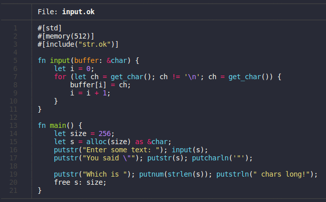
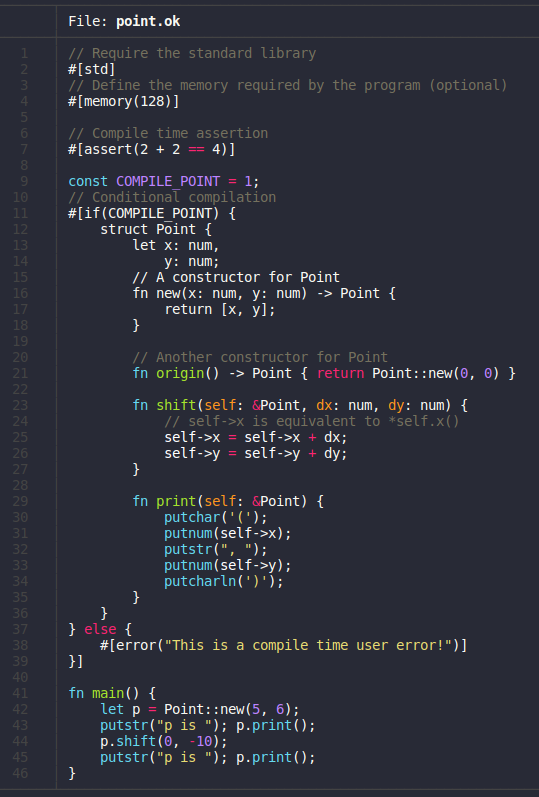

# Oak

An infinitely more portable alternative to the C programming language.



## Why Oak?

For those of you that remember ["free"](https://github.com/adam-mcdaniel/free), oak is essentially a more robust and high level version of that project. The goal of oak is to be as high level as possible in the frontend, but as small and low level as possible in the backend.

#### About the Author

I'm a freshly minted highschool graduate and freshman in college looking for work. If you enjoy my projects, consider supporting me by buying me a coffee! 

<a href="https://www.buymeacoffee.com/adammcdaniel" target="_blank"></a>

## Intermediate Representation

The key to oak's insane portability is its incredibly compact backend implementation. _The code for Oak's backend can be expressed in under 100 lines of C._ Such a small implementation is only possible because of the tiny instruction set of the intermediate representation. Oak's IR is only composed of **_17 different instructions_**. That's on par with [brainfuck](https://esolangs.org/wiki/Brainfuck)!

The backend of oak functions very simply. Every instruction operates on a _memory tape_. This tape is essentially a static array of double-precision floats.

```js
      let x: num = 5.25;    ...     let p: &num = &x;  `beginning of heap`
          |                             |                      |
          v                             v                      v
[0, 0, 0, 5.25, 0, 0, 0, 0, 0, 0, 0, 0, 3, 0, 0, 0, 0, 0, 0, ...]
                                                       ^
                                                       |
                          `current location of the stack pointer`
```

When a variable is defined in a function, it's given a static position relative to the virtual machine's current base pointer. So, when a function is called, space for the function's variables is allocated on the stack, and the base pointer is incremented to use this new space. Then, the compiler just replaces the variable with its address added to the base pointer offset in the rest of the code!

Additionally, the memory tape functions as a **_stack_** and a **_heap_**. After space for all of the program's variables is assigned, the memory used for the stack begins. The stack _grows_ and _shrinks_ with data throughout the program: when two numbers are summed, for example, they are popped off of the stack and replaced with the result. Similarly, the heap grows and shrinks throughout the program. The heap, however, is used for _dynamically allocated_ data: information with a memory footprint **unknown at compile time**.

Now that you understand how oak's backend fundamentally operates, here's the complete instruction set!

| Instruction | Side Effect |
|-|-|
| `push(n: f64);` | Push a number onto the stack. |
| `add();` | Pop two numbers off of the stack, and push their sum. |
| `subtract();` | Pop two numbers off of the stack. Subtract the first from the second, and push the result. |
| `multiply();` | Pop two numbers off of the stack, and push their product. |
| `divide();` | Pop two numbers off of the stack. Divide the second by the first, and push the result. |
| `sign();` | Pop a number off of the stack. If it is greater or equal to zero, push `1`, otherwise push `-1`. |
| `allocate();` | Pop a number off of the stack, and return a pointer to that number of free cells on the heap. |
| `free();` | Pop a number off of the stack, and go to where this number points in memory. Pop another number off of the stack, and free that many cells at this location in memory. |
| `store(size: i32);` | Pop a number off of the stack, and go to where this number points in memory. Then, pop `size` numbers off of the stack. Store these numbers in reverse order at this location in memory. |
| `load(size: i32);` | Pop a number off of the stack, and go to where this number points in memory. Then, push `size` number of consecutive memory cells onto the stack. |
| `call(fn: i32);` | Call a user defined function by it's compiler assigned ID. |
| `call_foreign_fn(name: String);` | Call a foreign function by its name in source. |
| `begin_while();` | Start a while loop. For each iteration, pop a number off of the stack. If the number is not zero, continue the loop. |
| `end_while();` | Mark the end of a while loop. |
| `load_base_ptr();` | Load the base pointer of the established stack frame, which is always less than or equal to the stack pointer. Variables are stored relative to the base pointer for each function. So, a function that defines `x: num` and `y: num`, `x` might be stored at `base_ptr + 1`, and `y` might be stored at `base_ptr + 2`. This allows functions to store variables in memory dynamically and as needed, rather than using static memory locations. |
| `establish_stack_frame(arg_size: i32, local_scope_size: i32);` | Pop off `arg_size` number of cells off of the stack and store them away. Then, call `load_base_ptr` to resume the parent stack frame when this function ends. Push `local_scope_size` number of zeroes onto the stack to make room for the function's variables. Finally, push the stored argument cells back onto the stack as they were originally ordered. |
| `end_stack_frame(return_size: i32, local_scope_size: i32);` | Pop off `return_size` number of cells off of the stack and store them away. Then, pop `local_scope_size` number of cells off of the stack to discard the stack frame's memory. Pop a value off of the stack and store it in the base pointer to resume the parent stack frame. Finally, push the stored return value cells back onto the stack as they were originally ordered. |

Using only these instructions, oak is able to implement _**even higher level abstractions than C can offer**_!!! That might not sound like much, but it's very powerful for a language this small.

## Syntax and Flags

The syntax of oak is heavily inspired by the Rust programming language.

Functions are declared with the `fn` keyword, and are syntactically identical to Rust functions, with the exception of the `return` semantics. Additionally, user defined types and constants are declared with the `type` and `const` keywords respectively.

Similar to Rust's outer attributes, Oak introduces many compile time flags. Some of these are demonstrated below along with other Oak features.



## Compilation Process

So how exactly does the oak compiler work?

1. Flatten structures into their functions
    - Structures in oak work differently than in other languages. The objects themselves are only arrays of memory cells: they don't have _**any**_ members or attributes. Structures _exclusively_ retrieve their data by using **_methods_** to return the addresses of their _"members"_. These methods are then flattened into simple functions. So, _`putnumln(*bday.day)`_ becomes _`putnumln(*Date::day(&bday))`_. This is a pretty simple process.

2. Calculate the size of every operation's type
    - Because of the structure of oak's intermediate representation, the type of every expression must be known for compilation to continue. The compiler combs over each expression and find's the size of its type. From here on, the representation of the code looks like this:

```rust
// `3` is the size of the structure on the stack
fn Date::new(month: 1, day: 1, year: 1) -> 3 {
    month; day; year
}
// self is a pointer to an item of size `3`
fn Date::day(self: &3) -> &1 { self + 1 }

fn main() -> 0 {
    let bday: 3 = Date::new(5, 14, 2002);
}
```

3. Statically compute the program's memory footprint
    - After totalling all the statically allocated data, such as the overall memory size of static variables and string literals, the program preemptively sets aside the proper amount of memory on the stack. This essentially means that the stack pointer is _immediately_ moved to make room for all the data at the start of the program.

4. Convert Oak expressions and statements into equivalent IR instructions
    - Most expressions are pretty straightforward: function calls simply push their arguments onto the stack in reverse order and call a function by it's ID, references to a variable just push their assigned location on the stack as a number, and so on. Method calls, _however_, are a bit tricky.

    There are **_many_** different circumstances where a method call is valid. Methods _**always take a pointer to the structure as an argument**_. However, _an object that calls a method is not required to be a pointer_. For example, the following code is valid: _`let bday: Date = Date::new(); bday.print();`_. The variable `bday` is not a pointer, yet the method _`.print()`_ can still be used. Here's why.

    When the compiler sees a flattened method call, it needs to find a way to transform the "instance expression" into a pointer. For variables, this is easy: just add a reference! For instance expressions that are already pointers, it's even easier: don't do anything! For any other kind of expression, though, it's a bit more verbose. The compiler sneaks in a hidden variable to store the expression, and then compiles the method call again using the variable as the instance expression. Pretty cool, right?

5. Assemble the IR instructions for a target
    - Because oak's IR is so small, it can support several targets. Even better, adding a target is incredibly easy. In oak's crate, there's a trait named `Target`. If you implement each of the IR's instructions for your language using the `Target` trait, then oak can automatically compile all the way down to your new programming or assembly language! _Yes, it's as easy as it sounds!_

## Documentation Tool

To allow users to read documentation of libraries and files without access to the internet, Oak provides the `doc` subcommand. This allows authors to add documentation attributes to their code to help other users understand their code or API without having to sift through the source and read comments.

Here is some example code.
```rust
#[std]
#[header("This file tests Oak's doc subcommand.")]

#[doc("This constant is a constant.")]
const CONSTANT = 3;
// No doc attribute
const TEST = CONSTANT + 5;

#[doc("This structure represents a given date in time.
A Date object has three members:
|Member|Value|
|-|-|
|`month: num` | The month component of the date |
|`day: num`   | The day component of the date   |
|`year: num`  | The year component of the date  |")]
struct Date {
    let month: num, day: num, year: num;

    #[doc("The constructor used to create a date.")]
    fn new(month: num, day: num, year: num) -> Date {
        return [month, day, year];
    }

    #[doc("Print the date object to STDOUT")]
    fn print(self: &Date) {
        putnum(self->month); putchar('/');
        putnum(self->day); putchar('/');
        putnumln(self->year);
    }
}

#[doc("This function takes a number `n` and returns `n * n`, or `n` squared.")]
fn square(n: num) -> num {
    return n * n
}

fn main() {
    let d = Date::new(5, 14, 2002);
    d.print();
}
```

And here is example usage of the `doc` subcommand to print the formatted documentation to the terminal.


## Installation

#### Development Build
To get the current development build, clone the repository and install it.

```bash
git clone https://github.com/adam-mcdaniel/oakc
cd oakc
cargo install -f --path .
```

#### Releases
To get the current release build, install from [crates.io](https://crates.io/crates/oakc).

```bash
# Also works for updating oakc
cargo install -f oakc
```

#### After Install

Then, oak files can be compiled with the oakc binary.

```bash
oak c examples/hello_world.ok -c
main.exe
```

## Dependencies

**C backend**
    - Any GCC compiler that supports C99

**Go backend**
    - Golang 1.14 compiler

**TypeScript backend**
	- TypeScript 3.9 compiler